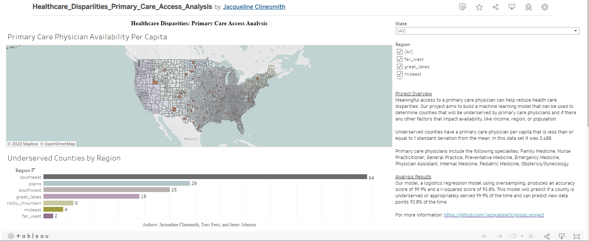

# Health Care Disparities - Primary Care Access Analysis

## Overview

## Analysis Results and Summary
Disparities in healthcare are an every day reality in the United States, so identifying ares for improvement is crucial for the health and well-being of communities. To answer the question "Are there are counties in the United States that will be underserved by primary care providers in the United States?", a supervised machine learning model is the most appropriate choice. Our model, a logistic regression model using oversampling, produces an accuracy score of 99.9% and a r-squared score of 93.8%. This model will predict if a county is underserved or appropriately served 99.9% of the time and can predict new data points 93.8% of the time. This means that the model is slightly overfitted, meaning it is possible some new data points will not accurately be predicted. 

Due to the data being split 19:1, the model must include oversampling and the removal of extraneous data. Before the logistic regression model included oversampling, the accuracy score was 96.2%, however, the r-squared score was -0.077%, meaning the model was an exceptionally poor fit and could not predict new data points with accuracy. Hyper tuning using SMOTE (Synthetic Minority Oversampling Technique) random oversampling and SMOTEENN (oversampling using SMOTE and cleaning using Edited Nearest Neighbor) using combination sampling does not improve the accuracy score or r-squared score of the model (both remain the same), and undersampling using random undersampling or cluster centroids undersampling lowers the accuracy score and drastically lowers the r-squared score, meaning the model is no longer a good fit and can no longer accurately predict new data. For this reason, undersampling the data should be avoided. 

According to the data, any county with 0.488 primary care physicians per capita or less is "underserved". Out of 3,092 counties, 148 are underserved, or ~5% of all counties, while 2881 counties, or ~95% of counties are appropriately served. While having 95% of the population adequately served is good, 5% of Americans being underserved means over 17 million Americans do not have access to a primary care physician. A primary care physician is defined as someone who can perform basic medical tests to evaluate a person's overall health. A primary care physician could specialize in family medicine, nurse practitioner, general practice, preventative medicine, emergency medicine, physician assistant, internal medicine, pediatric medicine, obstetrics, or gynecology.

Solutions to primary care physician disparities might include: virtual healthcare meetings (telehealth), providing loans to physicians to open new clinics, address primary care physician shortages by increasing funding for medical students to attend medical school, and empowering registered nurses legally and monetarily to provide care similar to a primary care physician. 

## Machine Learning Model
### Data Preprocessing

### Engineering and Selection of Model
* Supervised Machine Learning: Logistic Regression
  * We have a question we want to answer, therefore, supervised machine learning is the appropriate choice for this analysis. Logistic Regression will separate the data into two categories, counties that will be underserved by primary care physicians, and counties that will be appropriately served by primary care physicians.

### Training and Testing Split

### Benefits and Limitations

### Changes in model and hyper tuning

### Confusion Matrix, Accuracy Score, and R-squared Score
Confusion Matrix

Accuracy score: 99.9%

R-squared score: 93.8%

## Tableau Dashboard
A [tableau dashboard](https://public.tableau.com/views/Healthcare_Dispariities_Primary_Care_Access_Analysis/PCPAvailabilityDashboard?:language=en-US&:display_count=n&:origin=viz_share_link) was created to visualize the data and allow for easy filtering by region and state.

## Presentation
A [presentation](Resources/Healthcare_Disparities_Primary_Care_Access_Analysis.pdf) further outlines our approach, analysis, and results.

## Tools Used
Jupyter Notebook, Python, Pandas, Matplotlib, NumPy, Pathlib, Sklearn.metrics, Tableau, PostgreSQL, and Quick DBD

## Conceptual Entity Relationship Diagram 
ERD showing relationships between tabular data sources

## Database
PostgreSQL 11 used to house and query data

## Data Sources

## References
https://www.census.gov/popclock/

https://www.ncsl.org/research/health/increasing-access-to-health-care-through-telehealth.aspx

https://www.ncbi.nlm.nih.gov/pmc/articles/PMC6367893/

https://phdproject.org/educational-funding/

https://www.ruralhealthinfo.org/funding/3543

## Roles:

### Jacqueline
* Machine Learning Model
* Tableau Dashboard
* Presentation

### Jenny
* Conceptual ERD
* Income and ZCTA data
* Data Cleaning
* Machine Learning Model and Hyper Tuning
* Analysis Summary
* PostgreSQL Database 

### Tony
* Sources for Income & Population
* Data Cleaning & Merging
* PostgreSQL Database
